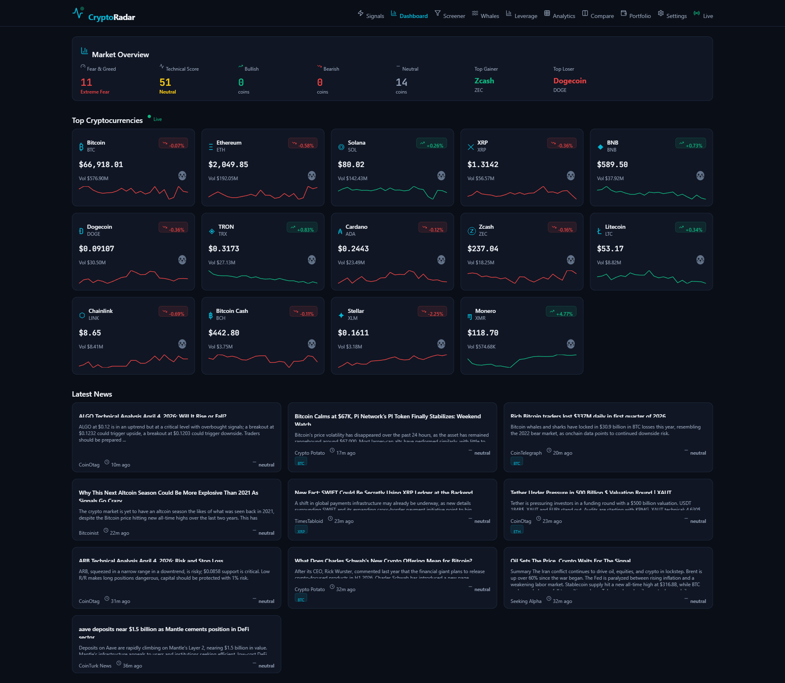
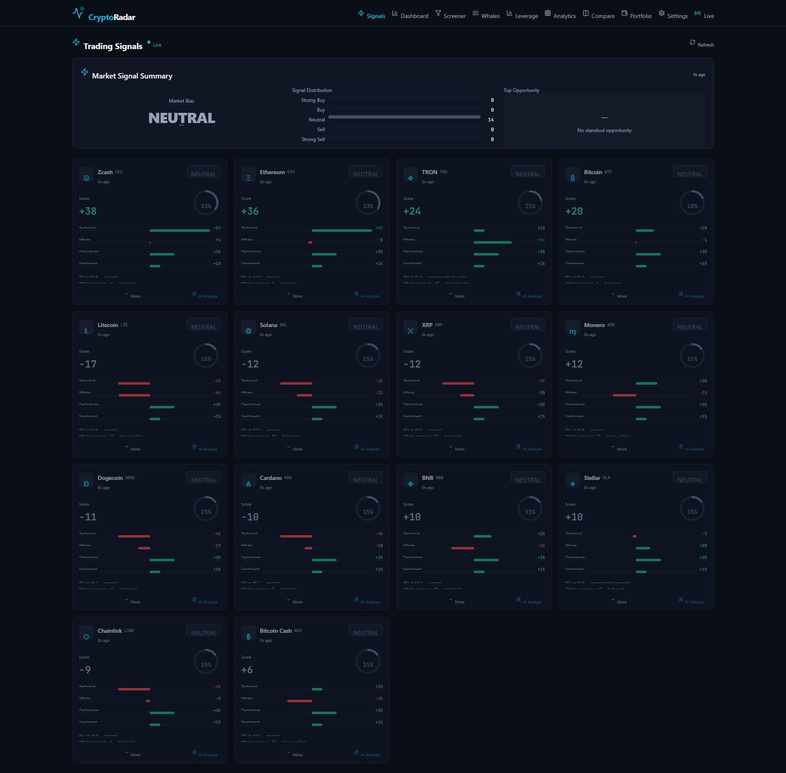
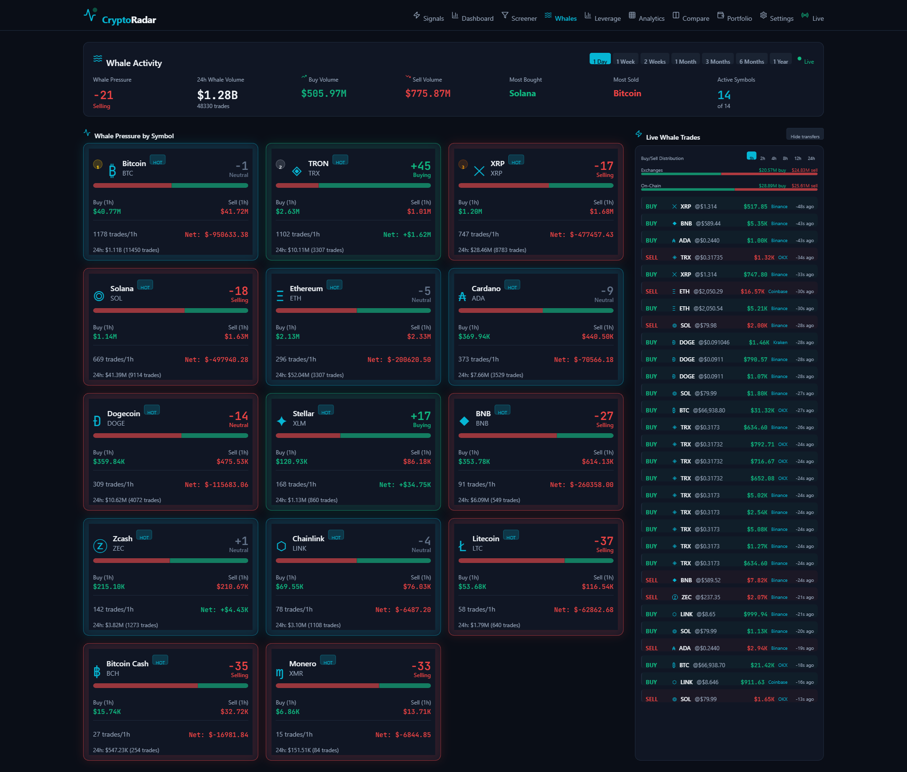
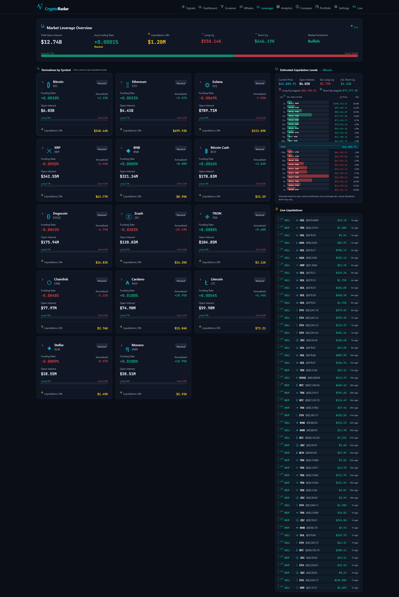

# CryptoRadar

Real-time cryptocurrency monitoring and trading signal platform with microservice architecture.



## Features

- **Live Market Dashboard** -- real-time prices, sparklines, and market overview for 14 cryptocurrencies
- **Trading Signals** -- automated 6-dimension scoring engine (Technical, Whale, Derivatives, Sentiment, Order Book, Macro) with confidence-weighted signal generation
- **Trade Setup Detectors** -- pluggable rule-based detectors (`TrendContinuationDetector`, `LiquiditySweepDetector`) that emit discrete trade setups alongside dimension scoring; new detectors auto-register as CDI beans, each measured independently by the outcome tracker
- **Signal Outcome Tracking** -- every actionable signal and detector setup is persisted and evaluated against live 1m candles; `GET /api/signals/metrics?periodDays=30` returns win rate, average R-multiple, profit factor, and per-strategy / per-signal-type / per-symbol breakdowns so signal quality can be measured, not guessed
- **Closed-Loop Feedback UI** -- visual feedback loop card on the Signals page showing fired→pending→closed→win-rate flow plus per-strategy comparison table
- **AI Analysis** -- integrated Google Gemini AI for on-demand trade evaluation with minimum 3:1 R:R constraint
- **Whale Tracking** -- real-time large trade detection across 6 exchanges (Binance, Coinbase, Kraken, OKX, Bybit, Bitfinex) + Whale Alert on-chain monitoring
- **Derivatives & Leverage** -- funding rates, open interest, long/short ratios, live liquidation streams, estimated liquidation level maps
- **Technical Analysis** -- RSI, MACD, Bollinger Bands, EMA/SMA, ATR, support/resistance, correlation matrix, volatility metrics
- **Screener** -- sortable/filterable table combining all data sources
- **Portfolio Tracker** -- manual position tracking with P&L
- **News Aggregation** -- CoinDesk API + RSS feeds with sentiment scoring
- **Data Export** -- CSV export for candles, whale trades, and liquidations

### Trading Signals



### Whale Activity



### Leverage & Liquidations



## Architecture

```
Frontend (React + Vite)
    |
API Gateway (Quarkus) :8080
    |
    +-- market-data-service :8081  -- Binance REST/WebSocket, candle storage, backfill
    +-- news-service :8082        -- CoinDesk API, RSS feeds, sentiment analysis
    +-- analytics-service :8083   -- Technical indicators, macro data, correlation
    +-- whale-service :8084       -- 6-exchange WebSocket streams, Whale Alert API
    +-- derivatives-service :8085 -- Funding rates, OI, liquidations (Binance/OKX/Bybit)
    +-- signal-service :8086      -- Multi-dimension scoring, Gemini AI integration
    |
    +-- TimescaleDB :5433  -- Time-series data (candles, trades, liquidations)
    +-- PostgreSQL :5434   -- News articles, metadata
    +-- Redis :6379        -- Pub/sub event bus between services
```

## Tech Stack

**Backend:** Java 21, Quarkus 3.17, RESTEasy Reactive, WebSocket, Scheduled tasks

**Frontend:** React 19, TypeScript, Vite 6, Tailwind CSS, TradingView Lightweight Charts

**Data:** TimescaleDB (hypertables), PostgreSQL, Redis pub/sub

**Infrastructure:** Docker Compose, Nginx, multi-stage builds

## Quick Start

### Prerequisites

- Docker and Docker Compose
- (Optional) [Whale Alert API key](https://developer.whale-alert.io) for on-chain tracking
- (Optional) [Google Gemini API key](https://aistudio.google.com/apikey) for AI analysis

### Setup

```bash
# Clone the repository
git clone https://github.com/artyomsv/crypto-radar.git
cd crypto-radar

# Create .env from template
cp .env.example .env

# (Optional) Add your API keys to .env
# WHALE_ALERT_API_KEY=your_key_here
# GEMINI_API_KEY=your_key_here

# Start all services
docker compose up -d
```

The dashboard will be available at **http://localhost:31000**

### Services

All host-exposed ports use the **31xxx** namespace (per `~/.claude/rules/local-port-ranges.md`) to avoid conflicts with gcloud, Tomcat, Spring Boot, Prometheus, and other dev tools that grab the conventional 80xx/8xxx/9xxx ports. Internal container ports stay on the conventional values, so service-to-service traffic in the docker network is unchanged.

| Service | Host Port | Internal Port | Description |
|---------|-----------|---------------|-------------|
| Frontend | **31000** | 80 | React dashboard (Nginx) |
| API Gateway | **31080** | 8080 | REST aggregation + WebSocket |
| Market Data | **31081** | 8081 | Binance price/candle data |
| News | **31082** | 8082 | News aggregation + sentiment |
| Analytics | **31083** | 8083 | Technical indicators + macro |
| Whale | **31084** | 8084 | Large trade tracking |
| Derivatives | **31085** | 8085 | Funding, OI, liquidations |
| Signals | **31086** | 8086 | Trading signal engine + AI |
| TimescaleDB | **31432** | 5432 | Time-series storage |
| PostgreSQL | **31433** | 5432 | News/metadata storage |
| Redis | **31379** | 6379 | Event pub/sub |

## Data Sources

| Source | Data | Auth Required |
|--------|------|--------------|
| Binance REST + WebSocket | Prices, candles, order book, trades | No |
| Binance Futures | Funding rates, OI, long/short, liquidations | No |
| OKX WebSocket | Trades, liquidations | No |
| Bybit WebSocket | Trades, liquidations | No |
| Coinbase WebSocket | Trades | No |
| Kraken WebSocket | Trades | No |
| Bitfinex WebSocket | Trades | No |
| CoinDesk Data API | News articles | No |
| CoinGecko | Market cap, dominance | No |
| DefiLlama | DeFi TVL | No |
| Alternative.me | Fear & Greed Index | No |
| Whale Alert | On-chain transfers | Yes (free tier) |
| Google Gemini | AI trade analysis | Yes (free tier) |

## Configuration

All configuration is managed via the `.env` file. See `.env.example` for available options.

Whale trade detection thresholds are tiered by market cap:
- BTC/ETH/BNB: $5,000+
- SOL/BCH/ZEC/XMR/LTC: $1,000+
- Others (DOGE, ADA, XRP, etc.): $500+

## License

[MIT](LICENSE)
